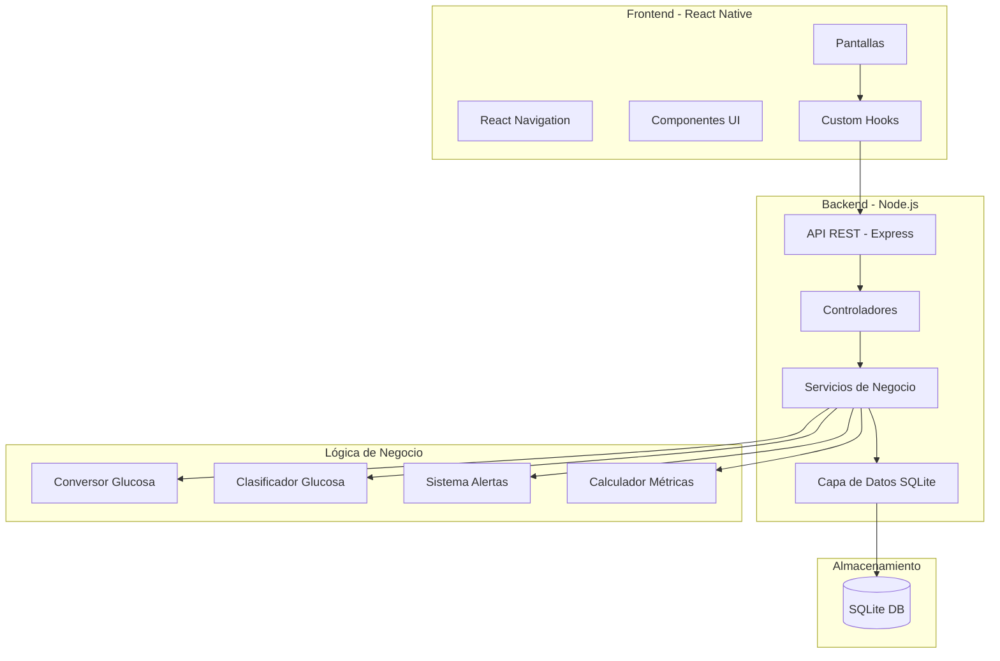
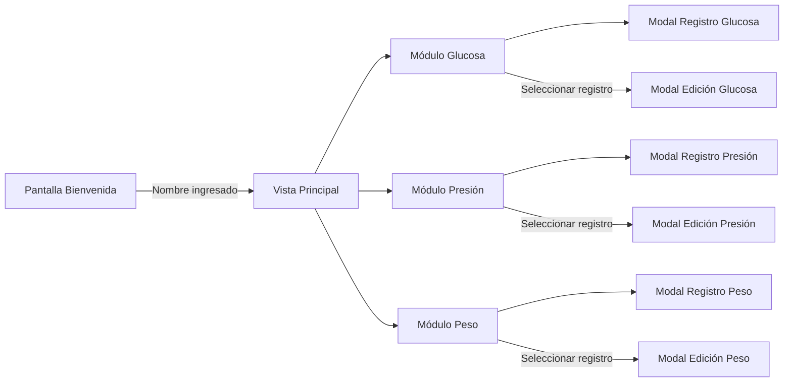

# Documento de Diseño: Health Tracker App

## Visión General

Esta aplicación móvil de seguimiento de salud está construida con React Native para Android, con un backend en Node.js y almacenamiento local SQLite. La arquitectura sigue un patrón cliente-servidor donde el frontend React Native se comunica con un servidor Node.js local que gestiona la persistencia de datos.

La aplicación se compone de tres módulos principales (Glucosa, Presión Arterial, Peso) accesibles desde una vista principal. Cada módulo permite crear, editar y eliminar registros. Al seleccionar un registro existente en la tabla, se abre un modal de edición pre-rellenado con los datos del registro (obtenidos por ID), permitiendo corregir datos incorrectos. Los campos de fecha en los formularios de creación tienen como valor predeterminado la fecha actual, pero el usuario puede modificarla. El módulo de glucosa incluye lógica de negocio crítica: conversión de unidades (mmol/L ↔ mg/dL), clasificación por rangos médicos y un sistema de alertas inteligentes.

El diseño visual utiliza glassmorphism con la tipografía Nunito Sans, priorizando la simplicidad para usuarios sin experiencia técnica.

## Arquitectura

### Diagrama de Arquitectura General



### Patrón Arquitectónico

Se utiliza una arquitectura de tres capas:

1. **Capa de Presentación (React Native):** Pantallas, componentes UI con glassmorphism, navegación. Consume la API REST del backend.
2. **Capa de Negocio (Node.js):** API REST con Express, controladores, servicios que encapsulan la lógica de conversión, clasificación y alertas de glucosa.
3. **Capa de Datos (SQLite):** Base de datos embebida accedida a través de una capa de abstracción en el backend.

### Flujo de Navegación



## Componentes e Interfaces

### Frontend - Componentes React Native

#### Pantallas (Screens)

| Pantalla | Descripción | Props/Params |
|---|---|---|
| `WelcomeScreen` | Configuración inicial, captura nombre | - |
| `HomeScreen` | Vista principal con 3 módulos | `userName: string` |
| `GlucoseScreen` | Tabla de registros, métricas, gráfico | - |
| `BloodPressureScreen` | Tabla de registros, métricas mensuales | - |
| `WeightScreen` | Tabla de registros, ejercicio semanal | - |

#### Componentes UI Reutilizables

| Componente | Descripción |
|---|---|
| `GlassCard` | Tarjeta con efecto glassmorphism (blur, transparencia, bordes) |
| `GlassModal` | Modal con efecto glassmorphism para formularios de registro y edición |
| `GlassButton` | Botón con estilo glassmorphism y bordes redondeados |
| `RecordTable` | Tabla genérica para mostrar registros de salud. Al seleccionar una fila, abre el modal de edición con los datos pre-rellenados |
| `MetricCard` | Tarjeta para mostrar una métrica resumida (promedio, máximo, tendencia) |
| `AlertBanner` | Banner de alerta con colores según severidad (rojo, amarillo) |
| `WeekDayChips` | Chips seleccionables para días de la semana (ejercicio) |
| `SimpleChart` | Componente de gráfico de líneas para tendencias |

### Backend - API REST (Node.js + Express)

#### Endpoints


| Método | Ruta | Descripción | Request Body | Response |
|---|---|---|---|---|
| `GET` | `/api/user` | Obtener configuración del usuario | - | `{ name: string }` |
| `POST` | `/api/user` | Crear/actualizar nombre de usuario | `{ name: string }` | `{ success: boolean }` |
| `GET` | `/api/glucose` | Listar registros de glucosa | - | `GlucoseRecord[]` |
| `POST` | `/api/glucose` | Crear registro de glucosa | `GlucoseInput` | `GlucoseRecord` |
| `GET` | `/api/glucose/:id` | Obtener registro de glucosa por ID | - | `GlucoseRecord` |
| `PUT` | `/api/glucose/:id` | Actualizar registro de glucosa | `GlucoseInput` | `GlucoseRecord` |
| `DELETE` | `/api/glucose/:id` | Eliminar registro de glucosa | - | `{ success: boolean }` |
| `GET` | `/api/glucose/metrics` | Obtener métricas semanales de glucosa | - | `GlucoseMetrics` |
| `GET` | `/api/glucose/alerts` | Obtener alertas activas de glucosa | - | `GlucoseAlert[]` |
| `GET` | `/api/blood-pressure` | Listar registros de presión | - | `BloodPressureRecord[]` |
| `POST` | `/api/blood-pressure` | Crear registro de presión | `BloodPressureInput` | `BloodPressureRecord` |
| `GET` | `/api/blood-pressure/:id` | Obtener registro de presión por ID | - | `BloodPressureRecord` |
| `PUT` | `/api/blood-pressure/:id` | Actualizar registro de presión | `BloodPressureInput` | `BloodPressureRecord` |
| `DELETE` | `/api/blood-pressure/:id` | Eliminar registro de presión | - | `{ success: boolean }` |
| `GET` | `/api/blood-pressure/metrics` | Obtener métricas mensuales de presión | - | `BPMetrics` |
| `GET` | `/api/weight` | Listar registros de peso | - | `WeightRecord[]` |
| `POST` | `/api/weight` | Crear registro de peso | `WeightInput` | `WeightRecord` |
| `GET` | `/api/weight/:id` | Obtener registro de peso por ID | - | `WeightRecord` |
| `PUT` | `/api/weight/:id` | Actualizar registro de peso | `WeightInput` | `WeightRecord` |
| `DELETE` | `/api/weight/:id` | Eliminar registro de peso | - | `{ success: boolean }` |
| `GET` | `/api/exercise` | Obtener ejercicio semanal | - | `ExerciseWeek` |
| `PUT` | `/api/exercise` | Actualizar ejercicio semanal | `ExerciseWeekInput` | `ExerciseWeek` |

#### Servicios de Negocio

```typescript
// GlucoseConverterService
interface GlucoseConverterService {
  mmolToMgdl(mmol: number): number;   // mmol * 18
  mgdlToMmol(mgdl: number): number;   // mgdl / 18
}

// GlucoseClassifierService
interface GlucoseClassifierService {
  classify(valueMgdl: number, context: MealContext): GlucoseClassification;
}

// GlucoseAlertService
interface GlucoseAlertService {
  evaluateAlerts(record: GlucoseRecord, recentRecords: GlucoseRecord[]): GlucoseAlert[];
}

// MetricsService
interface MetricsService {
  getWeeklyGlucoseMetrics(records: GlucoseRecord[]): GlucoseMetrics;
  getMonthlyBPMetrics(records: BloodPressureRecord[]): BPMetrics;
}
```

## Modelos de Datos

### Esquema SQLite

```sql
CREATE TABLE user_config (
  id INTEGER PRIMARY KEY AUTOINCREMENT,
  name TEXT NOT NULL CHECK(length(name) BETWEEN 1 AND 50),
  created_at TEXT DEFAULT (datetime('now'))
);

CREATE TABLE glucose_records (
  id INTEGER PRIMARY KEY AUTOINCREMENT,
  date TEXT NOT NULL,
  time TEXT NOT NULL,
  had_meal INTEGER NOT NULL DEFAULT 0,        -- 0 = no, 1 = sí
  hours_since_meal REAL,                       -- NULL si had_meal = 0
  value_mmol REAL NOT NULL,
  value_mgdl REAL NOT NULL,                    -- calculado: value_mmol * 18
  classification TEXT NOT NULL,                -- Normal, Prediabetes, Diabetes, Elevado, Hipoglucemia
  created_at TEXT DEFAULT (datetime('now')),
  updated_at TEXT DEFAULT (datetime('now'))
);

CREATE TABLE blood_pressure_records (
  id INTEGER PRIMARY KEY AUTOINCREMENT,
  date TEXT NOT NULL,
  time TEXT NOT NULL,
  systolic INTEGER NOT NULL,                   -- mmHg
  diastolic INTEGER NOT NULL,                  -- mmHg
  pulse INTEGER NOT NULL,                      -- bpm
  created_at TEXT DEFAULT (datetime('now')),
  updated_at TEXT DEFAULT (datetime('now'))
);

CREATE TABLE weight_records (
  id INTEGER PRIMARY KEY AUTOINCREMENT,
  date TEXT NOT NULL,
  weight_kg REAL NOT NULL,
  comments TEXT,
  created_at TEXT DEFAULT (datetime('now')),
  updated_at TEXT DEFAULT (datetime('now'))
);

CREATE TABLE exercise_weekly (
  id INTEGER PRIMARY KEY AUTOINCREMENT,
  week_start TEXT NOT NULL,                    -- fecha del lunes de la semana
  monday INTEGER DEFAULT 0,
  tuesday INTEGER DEFAULT 0,
  wednesday INTEGER DEFAULT 0,
  thursday INTEGER DEFAULT 0,
  friday INTEGER DEFAULT 0,
  saturday INTEGER DEFAULT 0,
  sunday INTEGER DEFAULT 0,
  avg_minutes_per_day REAL,                    -- NULL si ningún día seleccionado
  created_at TEXT DEFAULT (datetime('now'))
);
```

### Interfaces TypeScript

```typescript
// Tipos de contexto de comida
type MealContext = 'fasting' | 'post-meal';

// Clasificaciones de glucosa
type GlucoseClassification = 
  | 'Normal' 
  | 'Prediabetes' 
  | 'Diabetes' 
  | 'Elevado' 
  | 'Hipoglucemia';

// Tipos de alerta
type AlertSeverity = 'red' | 'yellow';
type AlertType = 
  | 'hypoglycemia' 
  | 'frequent_post_meal_high' 
  | 'frequent_high' 
  | 'critical';

interface GlucoseRecord {
  id: number;
  date: string;
  time: string;
  hadMeal: boolean;
  hoursSinceMeal: number | null;
  valueMmol: number;
  valueMgdl: number;
  classification: GlucoseClassification;
  createdAt: string;
  updatedAt: string;
}

interface GlucoseInput {
  date: string;
  time: string;
  hadMeal: boolean;
  hoursSinceMeal?: number;
  valueMmol: number;
}

interface GlucoseMetrics {
  weeklyAverage: number;
  weeklyMax: number;
  trend: 'ascending' | 'descending' | 'stable';
  previousWeekAverage: number;
}

interface GlucoseAlert {
  type: AlertType;
  severity: AlertSeverity;
  message: string;
}

interface BloodPressureRecord {
  id: number;
  date: string;
  time: string;
  systolic: number;
  diastolic: number;
  pulse: number;
  createdAt: string;
  updatedAt: string;
}

interface BloodPressureInput {
  date: string;
  time: string;
  systolic: number;
  diastolic: number;
  pulse: number;
}

interface BPMetrics {
  avgSystolic: number;
  avgDiastolic: number;
  avgPulse: number;
  month: string;
}

interface WeightRecord {
  id: number;
  date: string;
  weightKg: number;
  comments: string | null;
  createdAt: string;
  updatedAt: string;
}

interface WeightInput {
  date: string;
  weightKg: number;
  comments?: string;
}

interface ExerciseWeek {
  id: number;
  weekStart: string;
  days: Record<string, boolean>;  // monday..sunday
  avgMinutesPerDay: number | null;
}
```

### Lógica de Clasificación de Glucosa

```typescript
function classifyGlucose(valueMgdl: number, context: MealContext): GlucoseClassification {
  // Hipoglucemia tiene prioridad independiente del contexto
  if (valueMgdl < 70) return 'Hipoglucemia';

  if (context === 'fasting') {
    if (valueMgdl >= 70 && valueMgdl <= 99) return 'Normal';
    if (valueMgdl >= 100 && valueMgdl <= 125) return 'Prediabetes';
    if (valueMgdl >= 126) return 'Diabetes';
  }

  if (context === 'post-meal') {
    if (valueMgdl < 140) return 'Normal';
    if (valueMgdl >= 140 && valueMgdl <= 199) return 'Elevado';
    if (valueMgdl >= 200) return 'Diabetes';
  }

  return 'Normal'; // fallback
}
```

### Lógica de Alertas de Glucosa

```typescript
function evaluateAlerts(
  currentRecord: GlucoseRecord, 
  last7DaysRecords: GlucoseRecord[]
): GlucoseAlert[] {
  const alerts: GlucoseAlert[] = [];

  // Alerta roja: Hipoglucemia (< 70 mg/dL)
  if (currentRecord.valueMgdl < 70) {
    alerts.push({ type: 'hypoglycemia', severity: 'red', message: '...' });
  }

  // Alerta seria: Nivel crítico (>= 200 mg/dL)
  if (currentRecord.valueMgdl >= 200) {
    alerts.push({ type: 'critical', severity: 'red', message: '...' });
  }

  // Alerta amarilla: Elevación frecuente post-comida (>140 mg/dL, 3+ veces en 7 días)
  const postMealHighCount = last7DaysRecords.filter(
    r => r.valueMgdl > 140 && r.hoursSinceMeal !== null && r.hoursSinceMeal >= 1 && r.hoursSinceMeal <= 2
  ).length;
  if (postMealHighCount >= 3) {
    alerts.push({ type: 'frequent_post_meal_high', severity: 'yellow', message: '...' });
  }

  // Alerta amarilla: Niveles altos frecuentes (>180 mg/dL, 3+ veces en 7 días)
  const highCount = last7DaysRecords.filter(r => r.valueMgdl > 180).length;
  if (highCount >= 3) {
    alerts.push({ type: 'frequent_high', severity: 'yellow', message: '...' });
  }

  return alerts;
}
```


## Propiedades de Correctitud

*Una propiedad es una característica o comportamiento que debe mantenerse verdadero en todas las ejecuciones válidas de un sistema — esencialmente, una declaración formal sobre lo que el sistema debe hacer. Las propiedades sirven como puente entre especificaciones legibles por humanos y garantías de correctitud verificables por máquinas.*

### Propiedad 1: Round-trip de conversión de glucosa

*Para cualquier* valor válido de glucosa en mmol/L, convertir a mg/dL (multiplicando por 18) y luego convertir de vuelta a mmol/L (dividiendo por 18) debe producir un valor equivalente al original, dentro de una tolerancia de punto flotante (epsilon ≤ 0.01).

**Valida: Requisitos 4.1, 4.3**

### Propiedad 2: Clasificación correcta de glucosa según contexto y rango

*Para cualquier* valor de glucosa (en mg/dL) y cualquier contexto de medición (ayuno o post-comida), la función de clasificación debe retornar la categoría correcta según las siguientes reglas:
- Si el valor < 70: "Hipoglucemia" (independiente del contexto)
- Ayuno: [70-99] → "Normal", [100-125] → "Prediabetes", [≥126] → "Diabetes"
- Post-comida: [70-139] → "Normal", [140-199] → "Elevado", [≥200] → "Diabetes"

**Valida: Requisitos 5.1, 5.2, 5.3, 5.4, 5.5, 5.6, 5.7**

### Propiedad 3: Alertas por valor individual de glucosa

*Para cualquier* valor de glucosa registrado, si el valor es inferior a 70 mg/dL, el sistema de alertas debe generar una alerta de tipo "hypoglycemia" con severidad "red"; si el valor es igual o superior a 200 mg/dL, debe generar una alerta de tipo "critical" con severidad "red". Si el valor está entre 70 y 199 mg/dL, no debe generar ninguna alerta individual por valor.

**Valida: Requisitos 7.1, 7.4**

### Propiedad 4: Alertas por frecuencia de glucosa

*Para cualquier* conjunto de registros de glucosa de los últimos 7 días: si hay 3 o más registros post-comida con valor > 140 mg/dL, el sistema debe generar una alerta "frequent_post_meal_high" con severidad "yellow"; si hay 3 o más registros con valor > 180 mg/dL, debe generar una alerta "frequent_high" con severidad "yellow". Si las cantidades son menores a 3, las alertas correspondientes no deben generarse.

**Valida: Requisitos 7.2, 7.3**

### Propiedad 5: Métricas semanales de glucosa

*Para cualquier* conjunto no vacío de registros de glucosa de los últimos 7 días, el promedio semanal calculado debe ser igual a la suma de todos los valores dividida entre la cantidad de registros, y el valor máximo debe ser igual al mayor valor presente en el conjunto.

**Valida: Requisitos 6.1, 6.2**

### Propiedad 6: Tendencia de glucosa

*Para cualquier* par de promedios semanales (semana actual y semana anterior), la tendencia debe ser "ascending" si el promedio actual es mayor que el anterior, "descending" si es menor, y "stable" si son iguales.

**Valida: Requisito 6.3**

### Propiedad 7: Persistencia round-trip de registros (crear y leer por ID)

*Para cualquier* registro válido (glucosa, presión arterial o peso), al guardarlo en la base de datos y luego leerlo por su ID, todos los campos del registro recuperado deben ser equivalentes a los del registro original.

**Valida: Requisitos 3.6, 3.7, 8.4, 8.5, 9.4, 9.5, 10.2, 10.3**

### Propiedad 8: Round-trip de actualización de registros

*Para cualquier* registro existente (glucosa, presión arterial o peso) y cualquier conjunto válido de campos actualizados, al actualizar el registro mediante PUT y luego leerlo por su ID, todos los campos del registro recuperado deben reflejar los valores actualizados.

**Valida: Requisitos 3.8, 8.6, 9.6**

### Propiedad 9: Eliminación efectiva de registros

*Para cualquier* registro existente (glucosa, presión arterial o peso), al eliminarlo mediante DELETE, el registro no debe aparecer en la lista general (GET) ni ser recuperable por su ID (GET por ID debe retornar error 404).

**Valida: Requisitos 3.9, 8.7, 9.7**

### Propiedad 10: Promedios mensuales de presión arterial

*Para cualquier* conjunto no vacío de registros de presión arterial de un mes dado, los promedios de sistólica, diastólica y pulso deben ser iguales a la suma de cada campo dividida entre la cantidad de registros.

**Valida: Requisito 8.8**

### Propiedad 11: Filtrado de registros por mes

*Para cualquier* conjunto de registros de presión arterial y un mes seleccionado, todos los registros devueltos por el filtro deben pertenecer al mes seleccionado, y ningún registro del mes seleccionado debe quedar excluido.

**Valida: Requisito 8.9**

### Propiedad 12: Validación de nombre de usuario

*Para cualquier* string de longitud entre 1 y 50 caracteres, el sistema debe aceptarlo como nombre válido y almacenarlo correctamente. Para cualquier string vacío o de longitud superior a 50, el sistema debe rechazarlo.

**Valida: Requisitos 1.2, 1.3**

### Propiedad 13: Registros de glucosa contienen ambas unidades y clasificación

*Para cualquier* registro de glucosa almacenado, el registro debe contener tanto el valor en mmol/L como el valor en mg/dL (donde mg/dL = mmol/L × 18), y debe incluir un campo de clasificación no vacío correspondiente a una de las categorías válidas.

**Valida: Requisitos 3.1, 4.2**

## Manejo de Errores

### Errores de Validación de Entrada

| Escenario | Comportamiento |
|---|---|
| Nombre vacío en configuración inicial | Mostrar mensaje "El nombre es obligatorio" y mantener el formulario abierto |
| Nombre > 50 caracteres | Mostrar mensaje "El nombre no puede exceder 50 caracteres" |
| Valor de glucosa negativo o cero | Rechazar el registro y mostrar mensaje de validación |
| Campos obligatorios vacíos en modales | Deshabilitar botón de confirmación hasta que todos los campos requeridos estén completos |
| Presión sistólica ≤ diastólica | Mostrar mensaje indicando que la sistólica debe ser mayor que la diastólica |
| Peso negativo o cero | Rechazar el registro y mostrar mensaje de validación |
| ID de registro inexistente en edición/eliminación | Mostrar mensaje "Registro no encontrado" y refrescar la tabla |

### Errores de Base de Datos

| Escenario | Comportamiento |
|---|---|
| Error de escritura en SQLite | Mostrar alerta con mensaje descriptivo del error, intentar preservar datos en memoria |
| Error de lectura en SQLite | Mostrar mensaje de error y ofrecer reintentar la operación |
| Base de datos corrupta | Mostrar mensaje de error crítico e intentar recrear las tablas |

### Errores de API (Backend)

| Escenario | Comportamiento |
|---|---|
| Backend no disponible | Mostrar mensaje de conexión fallida con opción de reintentar |
| Timeout en petición | Reintentar automáticamente una vez, luego mostrar error al usuario |
| Respuesta con formato inválido | Registrar error en log y mostrar mensaje genérico al usuario |
| Registro no encontrado (GET/PUT/DELETE por ID) | Retornar HTTP 404 con mensaje descriptivo |

## Estrategia de Testing

### Enfoque Dual: Tests Unitarios + Tests Basados en Propiedades

La estrategia de testing combina tests unitarios para ejemplos específicos y casos borde, con tests basados en propiedades (PBT) para verificar propiedades universales con entradas generadas aleatoriamente. Ambos enfoques son complementarios y necesarios para una cobertura completa.

### Librería de Property-Based Testing

Se utilizará **fast-check** (`fc`) como librería de PBT para JavaScript/TypeScript, integrada con Jest como framework de testing.

### Tests Basados en Propiedades

Cada propiedad de correctitud definida en este documento debe implementarse como un único test basado en propiedades con un mínimo de 100 iteraciones. Cada test debe estar etiquetado con un comentario que referencia la propiedad del documento de diseño.

Formato de etiqueta: **Feature: health-tracker-app, Property {número}: {texto de la propiedad}**

| Propiedad | Descripción del Test | Generadores |
|---|---|---|
| P1 | Conversión mmol/L → mg/dL → mmol/L produce valor equivalente | `fc.float({ min: 0.1, max: 50.0 })` para valores de glucosa |
| P2 | Clasificación retorna categoría correcta según valor y contexto | `fc.float({ min: 0, max: 600 })` para valor, `fc.constantFrom('fasting', 'post-meal')` para contexto |
| P3 | Alertas individuales se generan correctamente según umbrales | `fc.float({ min: 0, max: 600 })` para valor de glucosa |
| P4 | Alertas de frecuencia se generan cuando hay 3+ registros en umbrales | `fc.array(glucoseRecordArbitrary, { minLength: 0, maxLength: 20 })` |
| P5 | Promedio y máximo semanal son matemáticamente correctos | `fc.array(fc.float({ min: 0.1, max: 600 }), { minLength: 1, maxLength: 50 })` |
| P6 | Tendencia es correcta según comparación de promedios | `fc.float()` para promedio actual y anterior |
| P7 | Crear y leer por ID produce datos equivalentes | Generadores específicos por tipo de registro |
| P8 | Actualizar y leer por ID produce datos actualizados | Generadores específicos por tipo de registro + generador de campos actualizados |
| P9 | Eliminar un registro hace que no sea recuperable | Generadores específicos por tipo de registro |
| P10 | Promedios mensuales de presión son matemáticamente correctos | `fc.array(bpRecordArbitrary, { minLength: 1, maxLength: 50 })` |
| P11 | Filtro por mes retorna exactamente los registros del mes | `fc.array(bpRecordArbitrary)` con fechas aleatorias |
| P12 | Nombres válidos (1-50 chars) se aceptan, inválidos se rechazan | `fc.string({ minLength: 0, maxLength: 100 })` |
| P13 | Registros de glucosa contienen ambas unidades y clasificación válida | `fc.float({ min: 0.1, max: 50.0 })` con contexto aleatorio |

### Tests Unitarios

Los tests unitarios se enfocan en ejemplos específicos, casos borde y puntos de integración. No se deben escribir demasiados tests unitarios ya que los tests de propiedades cubren la variedad de entradas.

| Área | Ejemplos de Tests |
|---|---|
| Conversión de glucosa | Valores conocidos: 5.5 mmol/L = 99 mg/dL, 7.0 mmol/L = 126 mg/dL |
| Clasificación de glucosa | Valores en los límites exactos de cada rango (70, 99, 100, 125, 126, 140, 199, 200) |
| Alertas | Exactamente 2 registros altos (no debe alertar), exactamente 3 (debe alertar) |
| Persistencia | Guardar y recuperar un registro específico con todos los campos |
| Edición de registros | Actualizar un campo específico de un registro y verificar que solo ese campo cambió |
| Eliminación de registros | Eliminar un registro y verificar que GET por ID retorna 404 |
| Fecha predeterminada | Verificar que al abrir el modal de registro, el campo de fecha tiene la fecha actual |
| Validación | Nombre vacío, nombre de 1 carácter, nombre de 50 caracteres, nombre de 51 caracteres |
| Navegación | Verificar que cada botón navega a la pantalla correcta |
| UI condicional | Modal muestra/oculta campo de tiempo según indicador de comida |
| Modal de edición | Verificar que al seleccionar un registro, el modal se abre con los datos pre-rellenados correctos |

### Configuración de Testing

```json
{
  "testFramework": "jest",
  "pbtLibrary": "fast-check",
  "pbtMinIterations": 100,
  "coverageTarget": "lógica de negocio (conversión, clasificación, alertas, métricas)"
}
```
